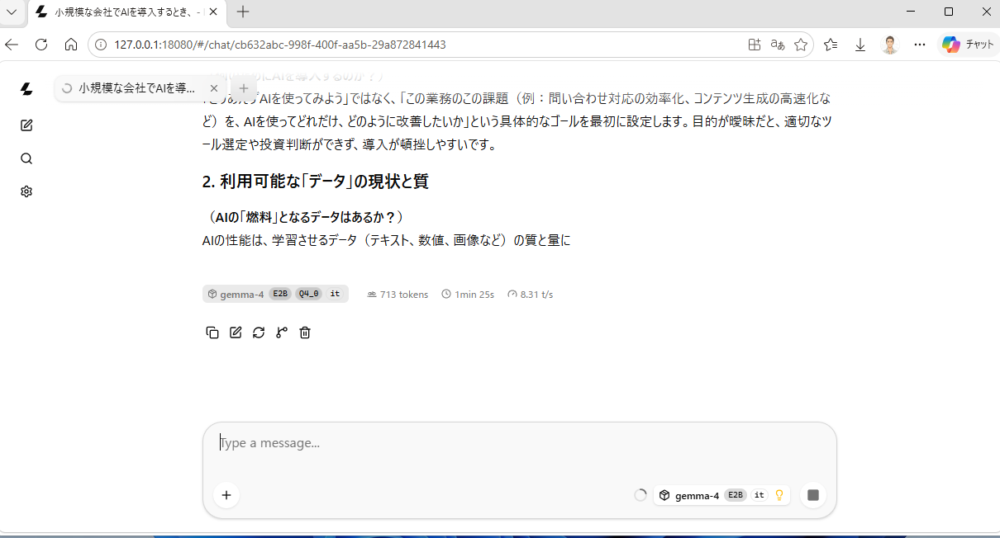
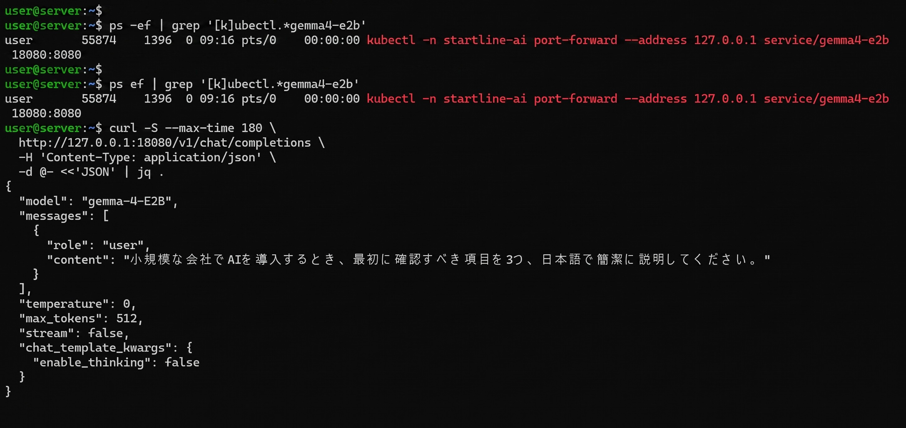
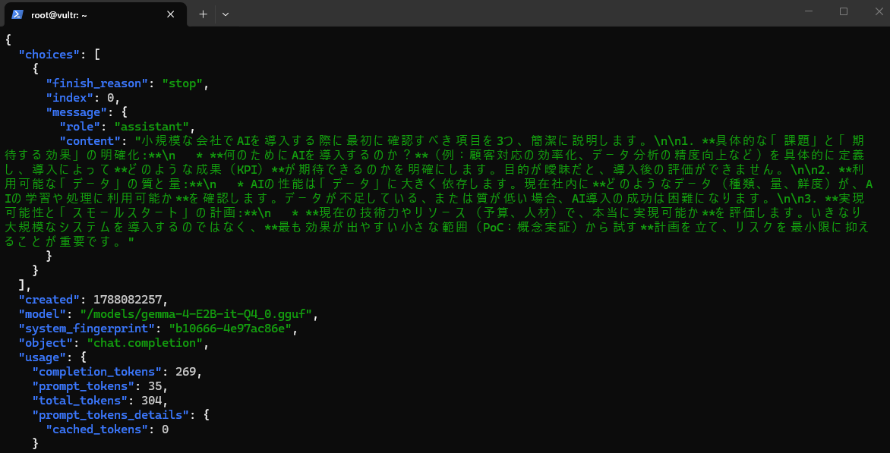

# AIF — AIインフラ構築・実機検証プロジェクト

English version: [README.md](./README.md)

AIFは、AIインフラの設計・構築・実機検証を扱う技術ポートフォリオです。CPUベースのKubernetes・LLM Serving基盤を自分で設計・構築・検証し、障害切り分けを行ったうえで、実装と匿名化済みの公開証跡を分離しています。

Implementation Showcaseは `53f0cf71c728fb52207d83c38007f9012ee23d77` 時点を基準にしています。実機取得時点と実装基準のコミットが異なる場合は、Evidence側で由来を分離して記録しています。

## 概要

- Ubuntu 24.04上に、containerd/runc、Flannel、CoreDNSを使ったシングルノードKubernetes基盤を構築。
- llama.cppでGemma 4 E2B Q4_0 GGUFをOpenAI-compatible APIとして提供。
- PrometheusとGrafanaで監視し、LLM・監視・E2E検証まで実施。
- 公開Evidenceは匿名化済みで、認証情報、raw log、ホスト固有情報、未加工のクライアントキャプチャを含めない。

## 現在のステータス

| Environment | Status | Scope |
|---|---|---|
| CPU Cloud | ✅ Built / E2E Validated | Kubernetes、ネットワーク、LLM Serving、監視、API検証、Evidence Collection |
| GPU Cloud | 🟡 Designed / Hardware Validation Pending | CUDA、GPU Operator、マルチGPU、GPU監視、Slurm |

## アーキテクチャ

```text
Windows Client
      |
      | SSH Tunnel / OpenAI-compatible API
      v
Vultr Ubuntu 24.04
      |
      v
containerd / runc
      |
      v
Kubernetes
      |
      +-- Flannel
      +-- CoreDNS
      |
      +-- llama.cpp
      |      |
      |      +-- Gemma 4 E2B Q4_0
      |
      +-- Monitoring
             |
             +-- Prometheus
             +-- Grafana
```

Windowsクライアント経路は、クライアントからのアクセス経路として検証しました。以下の補助キャプチャで、クライアントUI、ローカルAPIアクセス経路、OpenAI-compatible responseを確認できます。







これらは補助Evidenceであり、匿名化済みvalidation summaryを主証跡とします。配布先の公開ポリシーでローカルURL、ターミナル文脈、ホスト固有のUI情報が禁止されている場合は、再配布前に画像を確認してください。

## CPU Cloud環境

| 項目 | 内容 |
|---|---|
| Provider | Vultr Dedicated CPU |
| Region | Tokyo |
| OS | Ubuntu 24.04 |
| Compute | 4 vCPU、16 GB class |
| Runtime | containerd / runc |
| Orchestration | kubeadmによるKubernetes |
| Networking | Flannel、CoreDNS、UFWを考慮した検証 |
| LLM runtime | llama.cpp |
| Model | Gemma 4 E2B Q4_0 GGUF |
| Monitoring | Prometheus、Grafana |
| Client validation | Windows 11 |

## 構築フローと実装リンク

```text
Ubuntu 24.04
    → OS Baseline
    → containerd / runc / CNI
    → kubeadm Kubernetes
    → Flannel / CoreDNS
    → llama.cpp
    → Gemma 4 E2B
    → Prometheus / Grafana
    → OpenAI-compatible API
    → E2E Validation
    → Evidence Collection
```

| 工程 | 公開実装 |
|---|---|
| Precheck | [`00_precheck.sh`](./CPU_Cloud/scripts/00_precheck.sh) |
| OS baseline | [`01_os_baseline.sh`](./CPU_Cloud/scripts/01_os_baseline.sh) |
| containerd / runc / CNI | [`02_containerd.sh`](./CPU_Cloud/scripts/02_containerd.sh) |
| Kubernetes packages | [`03_kubernetes_packages.sh`](./CPU_Cloud/scripts/03_kubernetes_packages.sh) |
| kubeadm、Flannel、CoreDNS、UFW、DNS検証 | [`04_single_node_cluster.sh`](./CPU_Cloud/scripts/04_single_node_cluster.sh) |
| Model準備 | [`download_model.sh`](./CPU_Cloud/scripts/download_model.sh) |
| llama.cpp / Gemma Serving | [`05_llm_server.sh`](./CPU_Cloud/scripts/05_llm_server.sh) |
| Prometheus / Grafana | [`06_monitoring.sh`](./CPU_Cloud/scripts/06_monitoring.sh) |
| LLM、監視、E2E検証 | [`07_validate_stack.sh`](./CPU_Cloud/scripts/07_validate_stack.sh) |
| 匿名化済みEvidence summary | [`STARTLINE_Evidence`](./STARTLINE_Evidence/README.md) |

元のEvidence collectorと、そこに依存するprivateなパッケージング文脈は、このShowcaseから意図的に除外しています。公開Evidence summaryは手動で再構成した派生物であり、その制約も記録しています。

## Implementation Showcase

構築判断を確認できる範囲で、運用環境全体を公開しないよう選択した実装です。

- [`CPU_Cloud/README.md`](./CPU_Cloud/README.md) — 実装マップと公開境界。
- [`04_single_node_cluster.sh`](./CPU_Cloud/scripts/04_single_node_cluster.sh) — kubeadm、Flannel、CoreDNS readiness、UFWルール、DNS検証。
- [`05_llm_server.sh`](./CPU_Cloud/scripts/05_llm_server.sh) — llama.cpp deploymentとGemma設定。
- [`06_monitoring.sh`](./CPU_Cloud/scripts/06_monitoring.sh) — PrometheusとGrafanaのdeployment。
- [`07_validate_stack.sh`](./CPU_Cloud/scripts/07_validate_stack.sh) — 推論、監視、E2E検証。
- [`CPU_Cloud/kubernetes/llm`](./CPU_Cloud/kubernetes/llm) と [`CPU_Cloud/kubernetes/monitoring`](./CPU_Cloud/kubernetes/monitoring) — レビュー済みtemplate/manifest。
- [`CPU_Cloud/scripts/lib`](./CPU_Cloud/scripts/lib) — 検証、状態管理、UFW、安全なEvidence境界の補助コード。

runtime `config.env`、credentials、tokens/PAT、SSH key、private evidence、raw logs、host-specific data、environment-specific secretsは公開実装ツリーに含めていません。

## CPU性能の代表値

| 測定項目 | 結果 |
|---|---:|
| CPU | 4 vCPU |
| Memory | 16 GB class |
| Model | Gemma 4 E2B Q4_0 |
| Runtime | llama.cpp |
| Prompt tokens | 35 |
| Completion tokens | 269 |
| Generation time | 約31.5秒 |
| Generation throughput | 約8.5 tokens/sec |
| Japanese response | PASS |

上表はポートフォリオ用の代表的なCPU-onlyクライアント/API測定値であり、GPUベンチマークではありません。別のmachine-readable validation summaryでは固定プロンプトで約8.8 tokens/secを記録しており、いずれも検証済みCPU基盤における本番前の測定値です。

## Inference behavior analysis

検証リクエストでは `chat_template_kwargs.enable_thinking=false` を使用しています。reasoningを有効にすると遅延が増え、出力tokenも消費します。この検証経路ではthinkingを無効にすることで、最終的な日本語応答を維持しながら不要なreasoning出力を避けました。これは推論挙動の観察であり、モデル全般の性能チューニングを主張するものではありません。

## 検証結果

- Ubuntu 24.04 baseline: PASS
- containerd / runc / CNI: PASS
- Kubernetes packagesとsingle-node kubeadm cluster: PASS
- Flannel networkingとCoreDNS readiness: PASS
- DNS validation: PASS
- llama.cppとGemma Serving: PASS
- OpenAI-compatible API inference: PASS
- Japanese inference response: PASS
- PrometheusとGrafana: PASS
- Windows client access path: PASS
- LLM、監視、E2E validation: PASS
- 匿名化済みEvidence summary: available

元のcollector実行にはpackaging failure markerがあります。そのため「Evidence Collection」は、匿名化済みで手動再構成した公開Evidence derivativeが利用可能であることを示します。元のcollectorがcleanに完了したという意味ではありません。

## Troubleshootingと技術的な学び

### Script directory collision

- 症状: 共通shell helperが想定外のscript directoryを基準にpathを解決した。
- 原因: 汎用的な `SCRIPT_DIR` 変数が呼び出し側のpath contextと衝突した。
- 対応: helperのpath変数を分離し、path解決の所有者を明示した。
- 学び: shell libraryにはnamespace化した状態と決定的なpath所有権が必要。

### `pipefail` / SIGPIPE exit code 141

- 症状: piped outputを処理中、初期のpackage installがexit code 141で停止した。
- 原因: `pipefail` 下でproducerの完了前にdownstreamがpipeを閉じた。
- 対応: fragileなpipelineを限定的で明示的なcommand stepへ置き換え、gateを再実行した。
- 学び: shellの成功条件ではpipeline挙動とpackage manager failureを区別する必要がある。

### Kubernetes partial state

- 症状: 初期cluster checkで不健全な既存stateが検出された。
- 原因: hostがcleanなfirst-boot stateではなかった。
- 対応: partial stateで停止して調査し、暗黙にresetせず、後続のcleanなsingle-node pathを検証した。
- 学び: infrastructure scriptはrestart-awareであり、未知のstateを標準で破壊してはいけない。

### UFWとCoreDNSの依存関係

- 症状: Pod/API traffic timeout、CoreDNS watch failure、Service DNS failure、Prometheus targetの初期downが連鎖した。
- 原因: routed UFW denyがcluster traffic pathを遮断した。
- 対応: 必要なCNI/pod network allowanceを追加し、CoreDNS、DNS resolution、monitoring、API pathを再確認した。
- 学び: Kubernetes network failureは、firewall、overlay、DNS、service discovery、observabilityを横断して追跡する必要がある。

### LLM response-content validation

- 症状: 初期LLM validationでresponse envelopeは得られたが、利用可能なassistant contentがなかった。
- 原因: transport successだけではinference resultを証明できなかった。
- 対応: 実際のassistant contentと期待する日本語response pathを検証するようにした。
- 学び: API health checkはHTTP statusやJSON shapeだけでなく、semantic outputもassertすべき。

### Evidence packaging failure

- 症状: 元のcollectorがpublic/internal outputとmanifestの書き込み中に失敗した。
- 原因: packaging path/state handlingがruntime collectionから十分に分離されていなかった。
- 対応: 匿名化済みderivativeを手動再構成し、auditに制約を記録した。
- 学び: Evidence generationは独立したrelease stageであり、固有のfailure modeとreview gateを持つ。

## Public Evidence

実装とEvidenceを明確に分離しています。

**Implementation** → [`CPU_Cloud`](./CPU_Cloud/README.md)<br>
**Evidence** → [`STARTLINE_Evidence`](./STARTLINE_Evidence/README.md)

Evidence packageには、匿名化済みのarchitecture、deployment、validation、inference、monitoring、Windows-client summaryを収録しています。詳細は [`STARTLINE_Evidence/README.md`](./STARTLINE_Evidence/README.md) を参照してください。

## GPU Cloudの境界

GPU Cloudは引き続き **Designed / Hardware Validation Pending** です。設計対象はCUDA、GPU Operator、multi-GPU scheduling、GPU monitoring、Slurmです。このリポジトリではGPU throughput、stability、hardware validationについて主張しません。

## 公開リポジトリ構成

```text
AI_Cloud/
├─ README.md
├─ README_JA.md
├─ CPU_Cloud/
│  ├─ scripts/
│  ├─ kubernetes/
│  └─ README.md
├─ GPU_Cloud/
│  └─ design/
└─ STARTLINE_Evidence/
   └─ sanitized validation summaries
```

公開実装とEvidenceを分離した構成で、構築方法と実機検証結果をそれぞれ確認できます。
